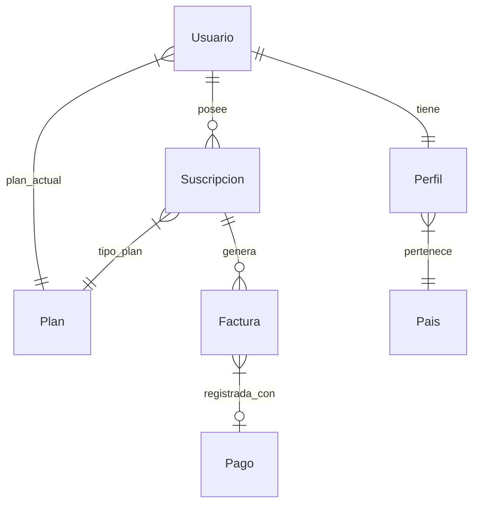

# SaaS Jacobo - Sistema de Gestión de Suscripciones y Facturación

Este proyecto es una plataforma SaaS desarrollada con **Spring Boot 3** que permite gestionar usuarios, planes de suscripción, facturación automática con impuestos dinámicos por país y un panel de auditoría para administradores.

## Tecnologías Utilizadas
- **Backend**: Java 17, Spring Boot 3.4.2, Spring Security, Spring Data JPA.
- **Base de Datos**: MySQL (con soporte para auditoría mediante Hibernate Envers).
- **Frontend**: Thymeleaf, Bootstrap 5, Vanilla CSS.
- **Herramientas**: Lombok, Maven.

---

## 📂 Estructura del Proyecto

```text
src/main/
├── java/com/SaaS_Jacobo/
│   ├── config/          # Seguridad, Carga de datos, Auditoría
│   ├── controller/      # Controladores Web (Web MVC)
│   ├── enums/           # Estados y Tipos de planes
│   ├── model/           # Entidades de Base de Datos (JPA)
│   ├── repository/      # Acceso a Datos (Spring Data JPA)
│   ├── service/         # Lógica de Negocio (Servicios)
│   └── scheduler/       # Tareas programadas (Renovaciones)
└── resources/
    ├── static/css/      # Estilos (style.css)
    ├── templates/       # Vistas (Thymeleaf HTML)
    └── application.properties # Configuración principal
```

### Detalle de carpetas
Esta carpeta contiene el código fuente principal de la aplicación:

1.  **`config`**:
    - `SecurityConfig`: Configuración de seguridad (roles, login, permisos).
    - `DataLoader`: Carga inicial de datos maestros (Planes, Países) y usuarios de prueba.
    - `EnversConfig`: Configuración para la auditoría de cambios en la base de datos.
    - `GlobalControllerAdvice`: Proporciona datos globales (como el usuario actual) a todas las vistas.

2.  **`controller`**:
    - `UsuarioController`: Gestión de registro y perfiles.
    - `SuscripcionController`: Gestión de planes y cambios de suscripción.
    - `FacturaController`: Visualización y filtrado de facturas.
    - `AuditoriaController`: Panel de administración para ver el historial de cambios.

3.  **`model`**:
    - Contiene las entidades JPA (`Usuario`, `Perfil`, `Suscripcion`, `Factura`, `Pais`, `Plan`, `Pago`).
    - Estas clases definen la estructura de la base de datos y sus relaciones.

4.  **`repository`**:
    - Interfaces que extienden `JpaRepository` para realizar operaciones CRUD y consultas personalizadas.

5.  **`service`**:
    - `SuscripcionService`: Lógica de negocio para altas, bajas y cambios de plan (prorrateo).
    - `FacturaService`: Generación de facturas calculando impuestos y desglose de conceptos.

6.  **`enums`**:
    - Enumeraciones como `EstadoSuscripcion` (ACTIVA, CANCELADA, etc.) y `TipoPlan` (BASIC, PREMIUM, ENTERPRISE).

7.  **`scheduler`**:
    - Tareas programadas (Cron jobs) que se ejecutan automáticamente (ej: renovación mensual).

### `src/main/resources`
Recursos no compilables:

-   **`templates/`**: Contiene todos los archivos HTML (Thymeleaf). Estructura dinámica para Facturación, Suscripción y Registro.
-   **`static/`**: Archivos estáticos como el CSS personalizado (`style.css`).
-   **`application.properties`**: Configuración principal de la aplicación (conexión a DB, puertos, etc.).

---

## Usuarios de Prueba

La aplicación viene precargada con dos tipos de perfiles para facilitar la corrección:

### 1. Perfil Administrador
Tiene acceso total, incluyendo el panel de **Auditoría**.
-   **Email**: `admin@saas.com`
-   **Contraseña**: `admin123`
-   **Rol**: `ROLE_ADMIN`

### 2. Perfil Usuario Demo
Un usuario estándar para probar la visualización de facturas y cambio de planes.
-   **Email**: `demo@saas.com`
-   **Contraseña**: `demo123`
-   **Rol**: `ROLE_USER`

---

## Funcionalidades Clave implementadas
- **Registro de Usuarios**: Creación de perfil, asignación de plan y generación de factura inicial automática.
- **Impuestos Dinámicos**: Se calcula el IVA automáticamente basado en el país seleccionado por el usuario.
- **Prorrateo**: Al cambiar de plan, el sistema calcula la diferencia de precio y genera una factura de ajuste detallada.
- **Auditoría Envers**: Los administradores pueden ver quién cambió qué y cuándo desde el panel de auditoría.
- **Persistencia Robusta**: Configurado para mantener los datos entre reinicios del servidor.

---

## 📊 Diagrama Entidad-Relación (Normalizado)



---

## ✅ Reporte de Pruebas (JUnit & Manuales)

Se han realizado pruebas exhaustivas sobre la lógica crítica del negocio para asegurar la integridad de los datos y los cálculos.

| Caso de Prueba | Entrada | Resultado Esperado | Resultado Real |
| :--- | :--- | :--- | :--- |
| **Cálculo IVA España** | Monto: 10€, Tasa: 21% | Impuesto: 2.10€ | ✅ Correcto |
| **Cálculo IVA USA** | Monto: 100€, Tasa: 0% | Impuesto: 0.00€ | ✅ Correcto |
| **Prorrateo Mes Completo** | Diferencia: 30€, Días: 30 | Prorrateo: 30.00€ | ✅ Correcto |
| **Prorrateo Medio Mes** | Diferencia: 20€, Días: 15 | Prorrateo: 10.00€ | ✅ Correcto |
| **Registro Único Email** | Email duplicado | Redirección con error | ✅ Correcto |
| **Persistencia de Datos** | Reinicio Servidor | Datos mantenidos | ✅ Correcto |
| **Recursión de Memoria** | Login Usuario | Sin StackOverflowError | ✅ Correcto |

---